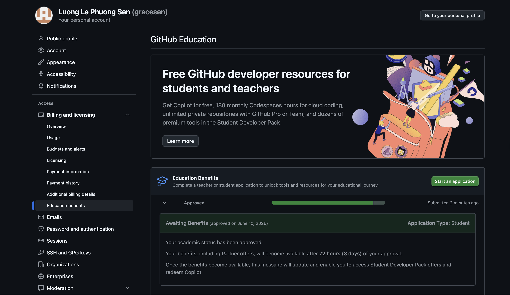

# Introduction
This reflection summarizes what I learned from the **Positron** videos and my experience exploring its features.^[Positron is developed by Posit Software.]

# What I like about Positron compared with RStudio
> *Based on what you learned from Step 1 and Step 3, what do you like about Positron compared with RStudio?*

After watching the videos, I found that Positron has a cleaner and more modern interface than RStudio. Since I was accustomed to RStudio, I initially found it a bit challenging to work with Positron. However, its layout is very flexible, and I can see it being very useful for large-scale projects. I also like that AI tools can be integrated directly into the workspace.

# AI in Positron
> *Describe the various ways you can use AI inside Positron.*

One feature that stood out to me was the AI integration. AI can help generate code, explain code, suggest fixes for errors, and answer programming questions. These tools can save time and help users learn new concepts more quickly.

::: {.callout-tip}
AI is helpful for learning and troubleshooting, but it is still important to check the code it generates.
:::

# GitHub Education and Copilot
> *Which AI tools have you installed or set up? Which AI tools did you find beneficial?*

I applied for GitHub Education and was approved for the Student Developer Pack. I am still learning how to set up GitHub Copilot in Positron. Having AI suggestions available while coding could help reduce mistakes and improve productivity.

{width=70%}

# GitHub Pages
> *Publish this report to GitHub Pages and provide a URL.*

URL:

# Conclusion
Overall, I enjoyed learning about **Positron**. I think it is a strong alternative to *RStudio*. I look forward to using it more in future assignments and in real-word projects.
